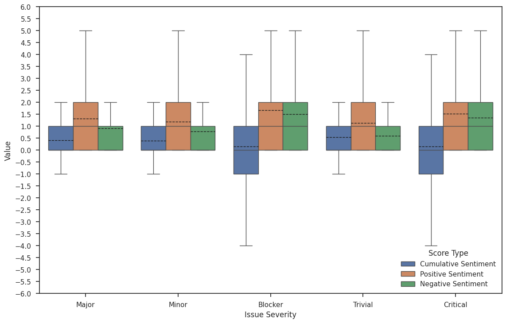

# Introduction
This Project analysis the relation between sentiment of developers with different factors like part of day , issue types , types of developers and severity of issues.

# Table of contents
- [Dataset Origin](#dataset-details)
- [Overview](#overview)
- [Sentiment Analysis Using seBERT](#sentiment-analysis-using-sebert)
- [Threats to Validity](#threats-to-validity)

  

## Dataset Origin

The dataset is derived from the 20-MAD (20-Year Massive Software Artifact Data) dataset, which integrates commit and issue data from Mozilla and Apache projects spanning over 20 years. Our dataset builds upon this foundation by adding sentiment analysis annotations to commit messages.

## Overview

The dataset includes:
- Commit messages from various open-source projects.
- Sentiment analysis of each commit message using a fine-tuned seBERT model.
- Metadata such as commit times, contributor categories, and issue types (bug/non-bug).

## Dataset Details

- **Projects Covered**: 114 Apache projects
- **Total Commits**: 641,628
- **Total Issues** : 297648
- **Sentiment Analysis**: Each commit message is annotated with the sentiment (positive, negative and neutral).
- **Metadata Included**:
  - Commit messages
  - Commit times
  - Contributor categories
  - Issue types (bug/non-bug)
  - "Part of the day" based on commit time

- **Top 10 Products Based on highest commits**:

| Products | Commits | Committers | Issues | Bugs  | Non-Bugs |
|----------|---------|------------|--------|-------|----------|
| HBASE    | 41661   | 192        | 14687  | 22184 | 19477    |
| AMBARI   | 35575   | 205        | 21145  | 26858 | 8717     |
| SLING    | 31377   | 127        | 6747   | 9146  | 22231    |
| CAMEL    | 26848   | 206        | 10458  | 8956  | 17892    |
| SPARK    | 26119   | 122        | 15958  | 11963 | 14156    |
| SOLR     | 22598   | 131        | 6728   | 8813  | 13785    |
| HIVE     | 18093   | 160        | 12709  | 10767 | 7326     |
| HDFS     | 17493   | 175        | 8104   | 7646  | 9847     |
| LUCENE   | 17468   | 110        | 5615   | 6573  | 10895    |
| HADOOP   | 15805   | 224        | 8238   | 8485  | 7320     |

- **Generated Tables for Research Questions**:

| commits             |            |
|---------------------|-----------|
| product             | *String*  |
| issue_id            | *String*  |
| working_times       | *String*  |
| committer           | *String*  |
| hash                | *String*  |
| commit_time         | *String*  |
| message_sentiment   | *String*  |
| issuetype           | *String*  |
| priority            | *String*  |
| category            | *String*  |

&nbsp;

| issue comments      | *String*  |
|---------------------|-----------|
| text_sentiment      | *String*  |
| product             | *String*  |
| issue_id            | *String*  |
| comment_id          | *String*  |
| priority            | *String*  |
| issuetype           | *String*  |

## Sentiment Analysis Using seBERT
For sentiment analysis, we used seBERT, a BERTLARGE model pre-trained on a large
corpus of textual data from the software domain that won the 2022 Natural Language-
based Software Engineering (NLBSE)
 

<em>seBERT fine-tuning pipeline for sentiment classification task</em>

 
 

<em>Training Dataset</em>

| Dataset    | Neutral Samples  |   Negatives Samples | Positive Samples | Total Samples|
|--------|-----------|------|----|-----|
| Github    |  3022 |   2087 | 2013 | 7122| 
| Jira    |  0 |   636 | 290 | 926 | 
| Stack Overflow 1   |  1191 |   178 | 131 | 1500 |
| Stack Overflow 2   |  2305 |   1119 | 576 | 4000 |
| API reviews   |  2635 |   1048 | 839 | 4522 |
| Total samples   |  9153 |   5068 | 3849 | 18070 |
         
 

Fine Tuning 
- Optimizer : AdamW
- Batch Size : 64
- Epoch : 5
- Model selection based on lowest validation loss
- Training hardware : RTX 3060 system
- Training time : Around 2 hours

 

<em>Model Evaluation</em>

| Metric    | Finetuned seBERT  |   SentiStrength-SE | 
|--------|-----------|------|
| MCC    |  79.06 % |   51.83 % |  
| Micro F1   |  87.16 % |   71.22 % |  
| Macro F1   |  85.86 % |   66.52 % | 
| F1 (negative)   |  86.8 % |   59.35 % | 
| F1 (neutral)  |  89.88 % |   78.47 % | 
| F1 (positive)   |  80.9 % |   61.73 % | 
| Precision (negative)   |  88.7 % |   78.53 % | 
| Precision (neutral)  |  89.31 % |   69.73 % | 
| Precision (positive)   |  79.95 % |   73.26 % | 
| Recall (negative)   |  84.97 % |   73.26 % | 
| Recall (neutral)  |  90.46 % |   91 % | 
| Recall (positive)   |  81.87 % |   53.33 % | 
 

## Result Analysis
- **RQ1: Does Commitfrequency affect the developer sentiment on the commit message?**
    
  
   - *Sentiment distribution across different committer frequencies* 
      | Sentiment     | High  |   Low | Medium
      |--------|-----------|------|----|
      | Negative    |  32721 |   884 | 5432 | 
      | Positive    |  12184 |   196 | 1820 | 
      | Neutral   |  495019 |   12261 | 81111 | 

    

  - *Chi Squared Test Result*  
     - Chi-squared Statistic: 55.067899563179445
     - p-value : 3.144 × 10-11

  - *Expected frequencies for each sentiment category across different committer frequencies.*
     | Sentiment     | High  |   Low | Medium
     |--------|-----------|------|----|
     | Negative    |  32849.272769 |    811.673769 | 5376.053462 | 
     | Positive    |  11949.168054 |   295.252389|  1955.579557 | 
     | Neutral   |  495125.559178 |   12234.073842 | 81031.366981 | 

  - *Standardized residuals for Committer Category* 
     | Category    | Negative  |   Positive | Neutral
     |--------|-----------|------|----|
     | High   |  -0.707736| 2.148267|-0.151437 
     | Medium    | 0.763030|-3.065889| 0.279748 | 
     | Low   |   2.538663 |-5.776227| 0.243438 | 

  - *Mann-Whitney U test*
      | Category    | U-statistics  |   P-value | 
     |--------|-----------|------|
     | High   |  3.053 × 1010 | P<<0.05| 
     | Medium    | 7.580 × 108|1.261 × 10-163| 
     | Low   |   1.430 × 107 |4.9 × 10-31| | 

  - *Mann-Whitney U test between positive and negative sentiment scores for each committer category*
      | Category    | High  |   Medium | Low
     |--------|-----------|------|----|
     | High   |  -| 0.199|-0.081
     | Medium    | 0.119|-| 0.286 | 
     | Low   |   0.081 |0.286| - | 

  

  
<em>Sentiment Frequencies of Commit messages by Committer’s Category</em>

 
   
  > **Answer to RQ1**  
  > The analysis reveals a significant association between committer frequency and commit sentiment. Low-category committers have significantly higher negative sentiment than other categories.
  

 
 

- **RQ2: Does working time affect the developer’s sentiment? Is the relation reflected on commit messages?**
    
  
   - *Sentiment distribution across different Part of Day* 
      | Sentiment     | Afternoon  |   Evening | Morning | Night |
      |--------|-----------|------|----|----------|
      | Negative    |  17623 |   8432 | 10037 |2945 |
      | Positive    |  5704 |   2963 | 3946 | 1587 |
      | Neutral   |  243483 |   133617 | 147416 | 63875| 

    

  - *Chi Squared Test Result*  
     - Chi-squared Statistic: 597.4521877544643
     - p-value : 8.266 × 10-126

  - *Expected frequencies for each sentiment category across different Part of Day*
     | Sentiment     | Afternoon  |   Evening | Morning | Night |
      |--------|-----------|------|----|----------|
      | Negative    |  16232.866973 | 8822.609743| 9819.603825 |4161.919460|
      | Positive    |  5904.826473 | 3209.290118 |3571.954154 |1513.929255 |
      | Neutral   |  244672.306555 | 132980.100139 | 148007.442021 | 62731.151285 |

  - *Standardized residuals for Part of Day Commit* 
     | Part of Day Commit   | Negative  |   Positive | Neutral
     |--------|-----------|------|----|
     | Afternoon   |  10.910854|-2.613469|-2.404371 |
     | Evening    | -4.158575 | -4.347529| 1.746537 |
     | Morning   |   2.193840 | 6.258524 | -1.537342 |
     |Night | -18.863184 | 1.877979| 4.566957 |

  - *Mann-Whitney U test*
      | Category    | U-statistics  |   P-value | 
     |--------|-----------|------|
     | Afternoon   |  7.091 × 109 | P<<0.05| 
     | Morning   | 2.667 × 109|4.591 × 10-232| 
     | Night  |   5.301 × 108 | 5.657 × 10-28| 
     |Evening | 2.225 × 109 | 4.836 × 10-235|   

  - *Mann-Whitney U test between positive and negative sentiment scores for each part of day*
      | Part of Day Commit | Morning            | Afternoon          | Evening           | Night             |
     |--------------------|--------------------|--------------------|-------------------|-------------------|
     | Morning        | –                  | 4.982 × 10−16     | 9.247 × 10−1     | 2.587 × 10−25    |
     | Afternoon      | 4.982 × 10−16     | –                  | 2.136 × 10−15    | 2.394 × 10−65    |
     | Evening        | 9.247 × 10−1      | 2.136 × 10−15     | –                 | 7.193 × 10−27    |
     | Night          | 2.587 × 10−25     | 2.394 × 10−65     | 7.193 × 10−27    | –                 |

  

  
<em>Sentiment Frequencies of Commit messages by Part of Day</em>
 

 

  > **Answer to RQ2**  
  > There is minimal association between working times and commit sentiment.
 Developers working at evening and night tend to show slightly higher negative
 sentiment.

  

- **RQ3: Is the developer’s emotion in the issue comment dependent on the issue type e.g. Bug?**
    
  
   - *Sentiment frequencies of issue comments across different issue types* 

      | Sentiment | Positive Count | Negative Count | Neutral Count |
      |-----------|----------------|----------------|---------------|
      | Bug       | 467,624         | 376,168        | 1,032,756     |
      | Non-bug   | 473,517         | 283,312        | 1,180,785     |

    
   
   
   
<em>Sentiment frequencies of issue comments across different issue types</em>

    

      
   
<em>Distribution of mean positive, negative, and cumulative sentiment scores of issues for different issue types</em>

     
     

  - *Chi Squared Test Result*  
     - Chi-squared Statistic: 22038.493
     - p-value : <<0.05

  - *Expected sentiment frequencies of issue comments across different issue
 types* 

      | Sentiment | Positive Count | Negative Count | Neutral Count |
      |-----------|----------------|----------------|---------------|
      | Bug       | 463036.510         | 324460.753        | 1089050.737     |
      | Non-bug   | 478104.490         | 335019.247        | 1124490.263     |

  - *Standardized residuals for issue types* 
     | Part of Day Commit   | Negative  |   Positive | Neutral
     |--------|-----------|------|----|
     | Bug  |   6.742|90.776|-53.944 |
     | Non-bug    | 6.635 | -89.334| 53.087 |
    

  - *Mann-Whitney U test*
      | Type    | U-statistics  |   P-value | 
     |--------|-----------|------|
     | Bug   |  8.366 × 1010 | P<<0.05| 
     | Non-bug   | 6.203 × 1010|P<<0.05| 
      

  - *Mann-Whitney U test between positive and negative sentiment scores for each part of day*
      | Type    | Bug  |   Non-bug | 
     |--------|-----------|------|
     | Bug   |  - | P<<0.05| 
     | Non-bug   | P<<0.05|-| 

   
  > **Answer to RQ3**  
  > Issue type significantly influences issue discussion sentiment. Issues related to bugs are associated with more negative sentiment, and so they show a wider range of cumulative emotional scores compared to issues that are not related to bugs.

  

- **RQ4: Do the emotions in the issue comments differ depending on the severity of the issue?**
    
  
   - *Sentiment frequencies of issue comments across different issue types* 

      | Severity  | Blocker | Critical | Major   | Minor   | Trivial |
      |-----------|---------|----------|---------|---------|---------|
      | Negative  | 39,716  | 49,265   | 439,509 | 117,301 | 13,689  |
      | Neutral   | 102,122 | 134,894  | 1,531,149 | 393,634 | 51,742  |
      | Positive  | 44,046  | 55,221   | 638,294 | 177,164 | 26,416  |

    
   
   
   

    
<em>Sentiment frequencies of issue comments across different severities</em>

    

      
   
<em> Distribution of mean positive, negative, and cumulative sentiment scores
   of issues for different severities </em>

     
     

  - *Chi Squared Test Result*  
     - Chi-squared Statistic: 5961.983
     - p-value : <<0.05

  - *Expected sentiment frequencies of issue comments across different issue
 types* 

      | Severity  | Blocker | Critical | Major   | Minor   | Trivial |
      |-----------|---------|----------|---------|---------|---------|
      | Negative  | 32139.899 | 41389.517 | 451095.592 | 118974.372 |15880.621
      | Neutral   | 107877.394 | 138923.686 | 1514099.878 | 399336.826 |53303.216  |
      | Positive  | 45866.708 | 59066.797 | 643756.530 | 169787.802 | 22663.164  |

  - *Standardized residuals for issue severities* 
     | Severity  | Blocker | Critical | Major   | Minor   | Trivial |
      |-----------|---------|----------|---------|---------|---------|
      | Negative  | 42.259 | 38.711 | -17.251 | -4.851 |-17.391
      | Neutral   | -17.523 | -10.811 |  13.856 | -9.024 |-6.762  |
      | Positive  | -8.501 | -15.824 | -6.808 | 17.901 | 24.929  |
    

  - *Mann-Whitney U test*
      | Severity    | U-statistics  |   P-value | 
     |--------|-----------|------|
     | Blocker   |  3.593 × 108 | 5.765 × 10-15| 
     | Critical  | 6.856 × 108|1.245 × 10-28| 
     | Major   | 1.313 × 1011|P<<0.05| 
     | Minor   | 1.271 × 1010|P<<0.05| 
     | Trivial   | 3.379 × 108|P<<0.05| 
      

  - *Mann-Whitney U test between cumulative sentiment scores for each pair of issue severities*
     | Severity  | Blocker | Critical | Major   | Minor   | Trivial |
      |-----------|---------|----------|---------|---------|---------|
      | Blocker  | - | 5.036 × 10-1 | 4.083 × 10-92 | 5.000 × 10-93 |5.012 × 10-193
      | Critical   | 5.036 × 10-1 | - |  1.413 × 10-113 | 2.917 × 10-113 |2.570 × 10-223  |
      | Major  | 4.083 × 10-92 | 1.413 × 10-115 | - | 2.329 × 10-2 | 8.469 × 10-113  |
      | Minor  |  5.000 × 10-93| 2.917 × 10-113 | 2.329 × 10-2 | - | 9.787 × 10-97  |
      | Trivial  | 5.012 × 10-193 | 2.570 × 10-223 | 8.469 × 10-113 | 9.787 × 10-97 |  - |

   
  > **Answer to RQ4**  
  >  Issue severity also significantly influences issue discussion sentiment. Blocker
 and critical severity issues are associated with more negative sentiment, while
 trivial issues tend to be associated with high positive sentiment.

## Threats to Validity
   - <u>*Internal Validity*</u> : The internal validity is limited by the accuracy of seBERT's sentiment analysis, which, despite outperforming SentiStrength-SE, is constrained by the lack of labeled commit message datasets.

   
   - <u>*Construct Validity*</u> : Categorizing commit times by the period of day could be influenced by developers' geographic locations and time zones, but this was accounted for using timezone data.

   - <u>*External Validity*</u> : The results are based on a large dataset of over 3.4 million commit messages, but the data is somewhat outdated, limiting its reflection of the current development environment.

   - <u>*Reliability*</u> : The study's methodology is well-documented, with all code available in a public repository, ensuring the study can be replicated.

   

## Usage

The dataset is provided in parquet. Due to large file size we split the dataset into five different parts. You can combine those and use it for various research purposes, including but not limited to:
- Sentiment analysis in software development
- Analyzing the relationship between commit sentiment and project outcomes
- Studying contributor behavior and patterns in open-source projects

